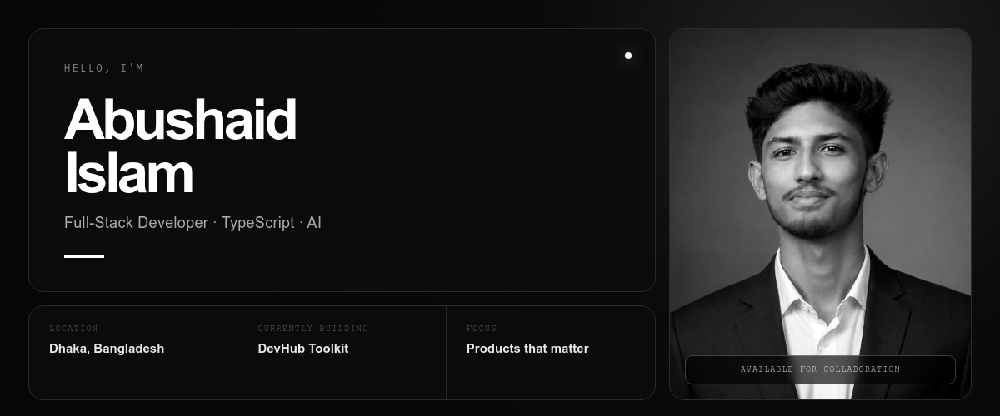
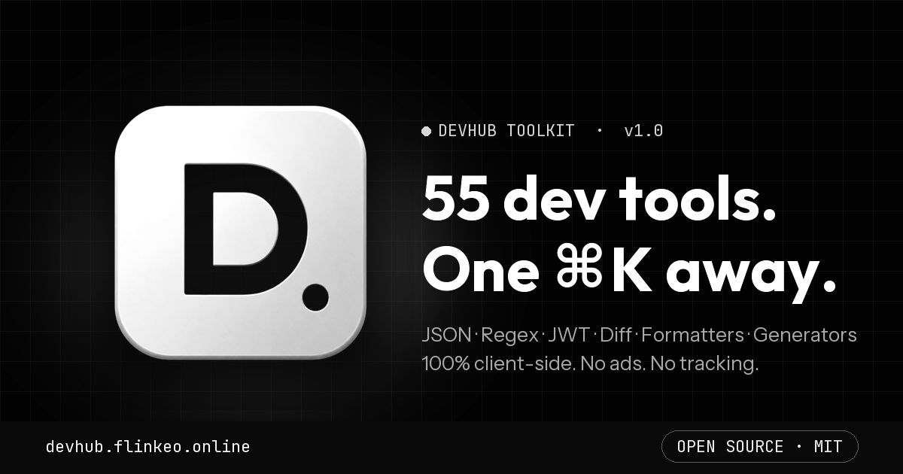
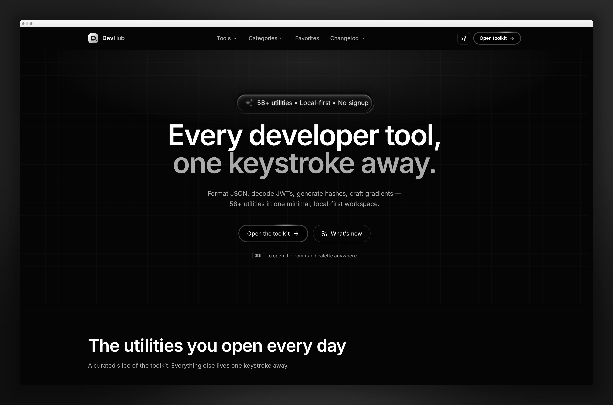
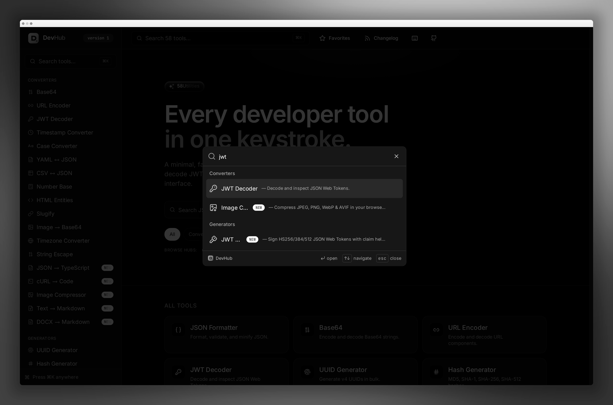
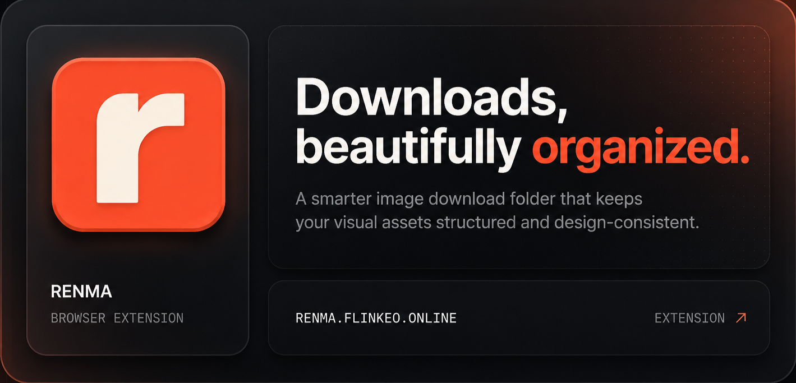

<p align="center">
  
</p>

<p align="center">
  <a href="https://syed.flinkeo.online"><b>PORTFOLIO</b></a>
  &nbsp;·&nbsp;
  <a href="https://linkedin.com/in/abushaidislam"><b>LINKEDIN</b></a>
  &nbsp;·&nbsp;
  <a href="mailto:abushaidislam7@gmail.com"><b>EMAIL</b></a>
  &nbsp;·&nbsp;
  <a href="https://devhub.flinkeo.online"><b>DEVHUB</b></a>
</p>

<br />

## About

I build scalable web products from interface to infrastructure. My current focus is **TypeScript**, production-ready **AI integrations**, developer tools, and B2B SaaS.

```ts
const abushaid = {
  location: "Dhaka, Bangladesh",
  role: "Full-Stack Developer",
  focus: ["TypeScript", "AI", "Developer Tools", "B2B SaaS"],
  currentlyBuilding: ["DevHub Toolkit", "Renma"],
  openTo: ["Collaboration", "Freelance", "Open Source"],
  goal: "Ship products that solve real problems.",
};
```

<br />

## Stack

| | |
| :-- | :-- |
| **Languages** | `TypeScript` · `JavaScript` · `HTML` · `CSS` |
| **Frontend** | `React` · `Next.js` |
| **Backend** | `Node.js` · `REST APIs` |
| **Data** | `PostgreSQL` · `MongoDB` · `Redis` |
| **Infrastructure** | `AWS` · `Vercel` · `Docker` · `Linux` |
| **Workflow** | `Git` · `GitHub` · `Postman` |

<br />

## Featured — DevHub Toolkit

<a href="https://devhub.flinkeo.online">
  
</a>

**55+ developer utilities in one fast, privacy-friendly workspace.** Format JSON, decode JWTs, generate hashes, build gradients, convert data, and access everyday tools without jumping between tabs.

- **Local-first:** tools run client-side
- **Fast access:** command palette with `⌘K`
- **Focused experience:** no ads, no tracking, no unnecessary signup
- **Explore:** [devhub.flinkeo.online](https://devhub.flinkeo.online)

<table>
<tr>
<td width="50%">
  
</td>
<td width="50%">
  
</td>
</tr>
</table>

<br />

## Building — Renma

<a href="https://renma.flinkeo.online">
  
</a>

**Renma** is a browser extension designed to keep downloaded images organized without turning the downloads folder into a mess. It helps maintain a clean, design-consistent image library that is easier to browse and use.

→ [renma.flinkeo.online](https://renma.flinkeo.online)

<br />

## More Projects

<table>
<tr>
<td width="50%" valign="top">

### B2B-v1

A B2B management platform for client relations, invoicing, and team workflows.

`TypeScript` `Node.js` `PostgreSQL`

[View source →](https://github.com/abushaidislam/B2B-v1)

</td>
<td width="50%" valign="top">

### Uptime Monitor

Real-time service monitoring with response tracking and downtime alerts.

`TypeScript` `Monitoring` `Vercel`

[View source →](https://github.com/abushaidislam/Uptime) · [Live →](https://uptime.flinkeo.online)

</td>
</tr>
<tr>
<td width="50%" valign="top">

### Readoft

An education platform focused on accessible learning and structured content delivery.

`Next.js` `TypeScript` `MongoDB`

[GitHub →](https://github.com/abushaidislam)

</td>
<td width="50%" valign="top">

### DMailova

An email marketing platform for campaigns, analytics, and automated flows.

`React` `TypeScript` `Node.js`

[GitHub →](https://github.com/abushaidislam)

</td>
</tr>
</table>

<br />

## Now

- [x] Launch B2B-v1 MVP
- [x] Build the first version of DevHub Toolkit
- [ ] Expand DevHub's utility collection
- [ ] Build and launch the Renma extension
- [ ] Ship DMailova beta
- [ ] Integrate AI into production applications
- [ ] Launch a SaaS product with paying users

<br />

<p align="center">
  <b>Building from Dhaka for the world.</b>
  <br /><br />
  <a href="https://portfolio.flinkeo.online">Portfolio</a>
  &nbsp;·&nbsp;
  <a href="https://studio.flinkeo.online">Studio</a>
  &nbsp;·&nbsp;
  <a href="https://devhub.flinkeo.online">DevHub</a>
  &nbsp;·&nbsp;
  <a href="https://renma.flinkeo.online">Renma</a>
  &nbsp;·&nbsp;
  <a href="mailto:abushaidislam7@gmail.com">Email</a>
</p>
